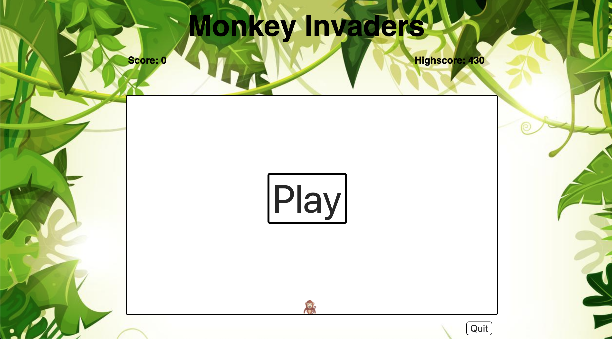
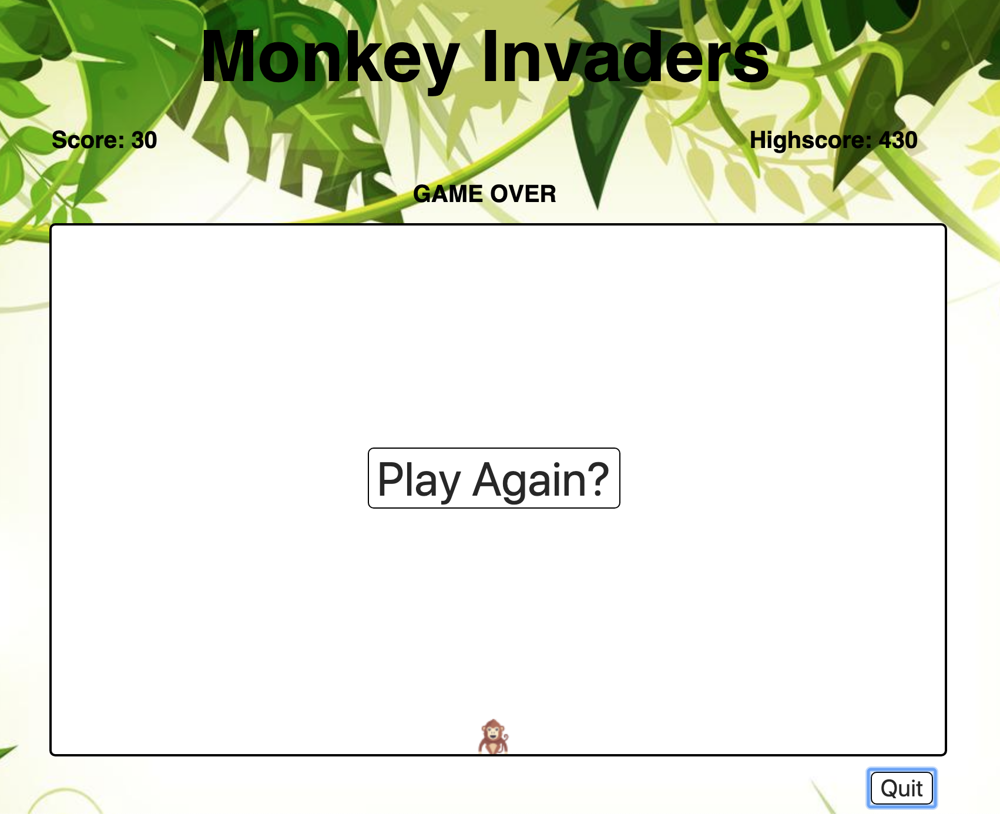
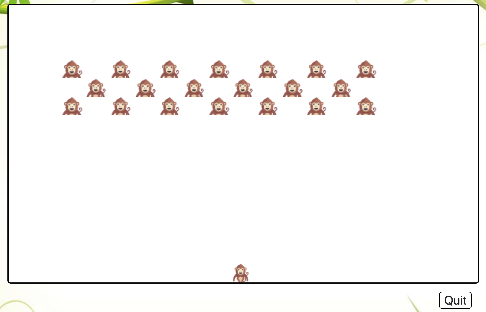

# General Assembly WDI Project 1: Simple Front End game

[Monkey Invaders Link](grose01.github.io/wdi-project-1)

Monkey Invaders was my take on the classic arcade game Space Invaders. This was my first project on General Assembly's Web Development Immersive Course. It was an individual project after 3 weeks of learning HTML, CSS and JavaScript.

---

## Brief

* To create a single page grid-based game rendered in the browser
* Design logic to carryout the game and allow the user to win/lose
* Include HTML / CSS / JavaScript files
* Use JavaScript / jQuery for DOM manipulation
* Deploy your game online, using Github Pages, where the rest of the world can access it

Requirements:
* The player should be able to clear at least one wave of aliens
* The player's score should be displayed at the end of the game

Timeframe: 7 days (February 2019)

## Technologies Used:

* HTML5
* CSS
* JavaScript + jQuery
* GitHub

## Game Overview:

Monkey invaders is a variation of the traditional space invaders, with the player having to kill 20 monkeys per level.
Each monkey gains a score of 10.
There are 6 levels. Each level increases the speed the monkeys move.

Game controls:
* player movement: ← and → keys
* player fire: space bar

## Approach Taken

### Grid & Starting Layout

I created a grid by creating div element, giving them the class of 'gridbox' and appending them to a grid, and pushing the gridbox into an empty array. this gave me a basic grid with the id of each div set as its index.

### Functionality

* **Alien set up and movement**
Twenty aliens were constructed by being given a starting indexes. The set up function was called when the play and play again buttons were clicked. Using a set interval, the aliens moved information by adding the class 'alien' to their index +/-1, depending on the direction, and removing the class from the previous gridbox. this occurred until the aliens reached the side of the grid where they dropped a level and continued in the other direction.

```
move() {
  this.movementId = setInterval(() => {
    if (this.currentIndex < 266) {
      $(board).eq(this.currentIndex).removeClass('alien')
      if(this.isHit){
        clearInterval(Laser.laserFire)
        $(board).eq(this.isHit).removeClass('alien')
      }
      if (this.currentMoves < 4) {
        this.currentMoves++
        if(this.isMovingRight) {
          this.currentIndex++
        } else {
          this.currentIndex--
        }
      } else {
        this.currentIndex += 19
        this.currentMoves = 0
        this.isMovingRight = !this.isMovingRight
      }
      this.render()
      if(this.isHit){
        clearInterval(this.movementId)
      }
    } else {
      gameover()
      clearInterval(this.movementId)
    }
  }, intervalTime)
}
```

* **Player**
The player moved left/right and fired using keypresses. I used a switch method within the bottom level of gridboxes.

#### Featured piece of code 1

This was a big challenge I had in the project. When the alien fires the fire moves up the grid by adding and removing the 'laser' class to the 'gridbox' divs, the challenge came when trying to identify if a div contained both the class of alien and laser and that exact moment in time. this required the alien to die and the score to increase.

```
fire() {
  this.laserFire = setInterval(() => {
    let isHit = false
    $(board).eq(this.currentFire).removeClass('laser')
    if (this.currentFire >= 19) {
      this.currentFire -= 19
      aliens.forEach( (alien, alienIndex) => {
        if (alien.currentIndex === this.currentFire){
          alien.isHit = true
          $(board).eq(alien.currentIndex).removeClass('alien laser')
          clearInterval(this.laserFire)
          aliens.splice(alienIndex, 1)
          isHit = true
          currentScore += 10
          $score.text(currentScore)
          if (aliens.length === 0) {
            levelUp()
          }
        } else {
          !isHit && $(board).eq(this.currentFire).addClass('laser')
        }
      })
    } else {
      clearInterval(this.laserFire)
    }
  }, 50)
}
```

### Styling

I used CSS to style my game, working on responsiveness and a neat clean finish. External images are used for icons.

---

## Screenshots

The game begins by clicking the 'Play' in the middle of the grid.


Once the quit button is pressed, the player gets the option to play again.


This shows the formation of the monkeys.


---

## Wins and Challenges

Wins:
* Getting a functioning game to work complete with levels and a scoring system.
* A simple finish, exactly how I wanted, however I only added responsive design at the end of the styling process therefore the site is not as responsive as I would like.
* Using setIntervals and clearInterval for functionality.

Challenges:
* Creating and moving the aliens in formation so that when one is killed, it keeps the formation.
* Successfully identifying when the laster hits the alien and therefore 'kills' the alien.

---

## Future Features

If I had more time, I would have liked to add:

* Make the aliens fire back
* Give the player lives
* Create a mothership with more points
* Improve on responsiveness

---

## Key Learnings

The learnings in this project were endless, it was my first development project and so it was all new. I overcame issues in both JavaScript functionality and CSS styling. For me the process of implementing new things as a continuous trialing process taught me not to fear asking for help! I now am much more comfortable with using CSS and front-end function using JavaScript.
